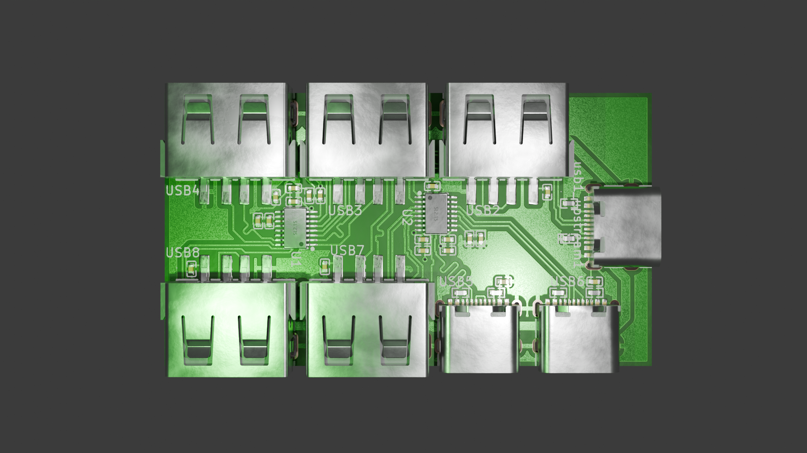
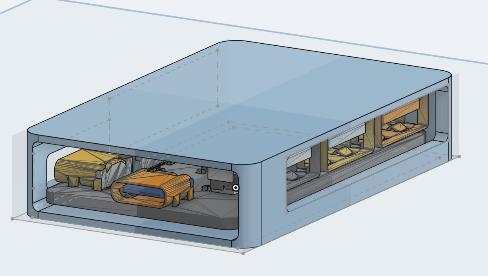
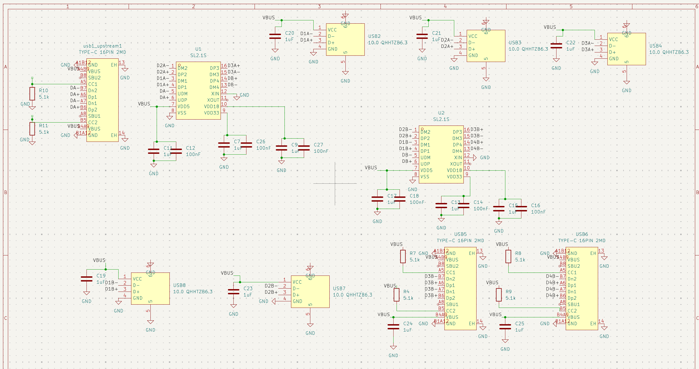
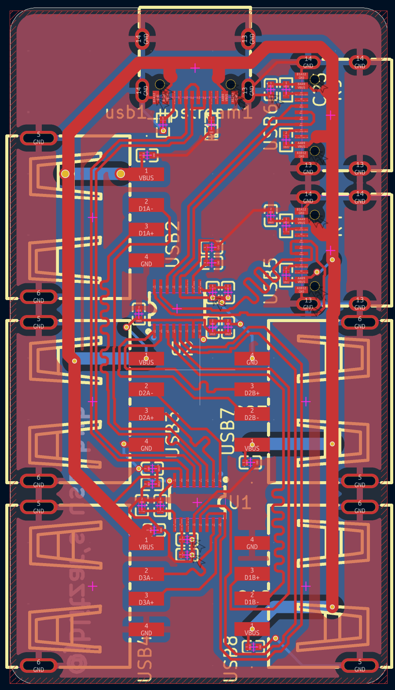

# uhub

## Pictures

## What this project is and why I made it

It's a USB hub. It has one upstream USB-C port, and seven downstream ports: Five USB-A and two USB-C. Since the ICs only support four downstream ports, I daisy-chained two of them.

I wanted to make it to connect to more accessories at a time, for use either on my laptop or with my raspberry pi. I also wanted to make it to level up my PCB design skills, after making a macropad. The routing was considerably more difficult, because there a lot more considerations to be made regarding impedance et al.

## PCB Images

## Requirements

YOUR PROJECT IS ACTUALLY COMPLETE:

- [x] It has a complete CAD assembly, with all components (including electronics) (CAD/usbhub_assembly.step)
- No firmware, the IC chip doesn't need any and it's otherwise just hardware.
- [x] You have sanity checked your design with someone else (on Slack)
- [x] (optional) you have a 3D render of your project!

YOUR GITHUB REPOSITORY CONTAINS ALL OF YOUR PROJECT FILES:

- [x] a BOM, in CSV format in the root directory, WITH LINKS (BOM.csv)
- [x] the source files for your PCB, if you have one (.kicad_pro, .kicad_sch, gerbers.zip, etc) (PCB/usbhub/)
- [x] A .STEP file of your project's 3D CAD model (and ideally the source design file format as well - .f3d, .FCStd, etc) (CAD/usbhub_assembly.step, CAD/README.md)
- [x] ANY other files that are part of your project (firmware, libraries, references, etc)
- [x] You have everything easily readable and organized into folders.
- If you're missing a .STEP file with all of your electronics and CAD, your project will not be approved.

YOUR README.md FILE CONTAINS THE FOLLOWING:

- [x] A short description of what your project is
- [x] A couple sentences on why you made the project
- [x] PICTURES OF YOUR PROJECT
- [x] A screenshot of a full 3D model with your project
- [x] A screenshot of your PCB, if you have one
- (N/A) A wiring diagram, if you're doing any wiring that isn't on a PCB
- [x] A BOM in table format at the end of the README

YOU DO NOT HAVE:

- AI Generated READMEs or Journal entries
- Stolen work from other people
- Missing firmware/software

## Credits

USB Hub Guide: https://rudymakes.com/blog/usb-hub/

I'd like to credit this guide, since I used it as reference, but my design is distinct and my own.

## Bom in table format

+1x case (3d printed for free, not included in BOM)

| Link                                              | Footprint                        | Quantity | Value            | LCSC Part # | Designator                                                    |
| ------------------------------------------------- | -------------------------------- | -------- | ---------------- | ----------- | ------------------------------------------------------------- |
| https://www.lcsc.com/product-detail/C29266.html   | C0402                            | 13       | 1uF              | C29266      | C11, C13, C15, C17, C19, C20, C21, C22, C23, C24, C25, C7, C9 |
| https://www.lcsc.com/product-detail/C60474.html   | C0402                            | 6        | 100nF            | C60474      | C12, C14, C16, C18, C26, C27                                  |
| https://www.lcsc.com/product-detail/C105872.html  | R0402                            | 6        | 5.1k             | C105872     | R10, R11, R4, R7, R8, R9                                      |
| https://www.lcsc.com/product-detail/C2684433.html | SSOP-16_L4.6-W2.6-P0.53-LS4.0-BL | 2        | SL2.1S           | C2684433    | U1, U2                                                        |
| https://www.lcsc.com/product-detail/C2765186.html | USB-C-SMD_TYPE-C-16PIN-2MD-073   | 3        | TYPE-C 16PIN 2MD | C2765186    | USB1_UPSTREAM1, USB5, USB6                                    |
| https://www.lcsc.com/product-detail/C668591.html  | USB-A-TH_10.0QHHTZB6.3           | 5        | 10.0 QHHTZB6.3   | C668591     | USB2, USB3, USB4, USB7, USB8                                  |
